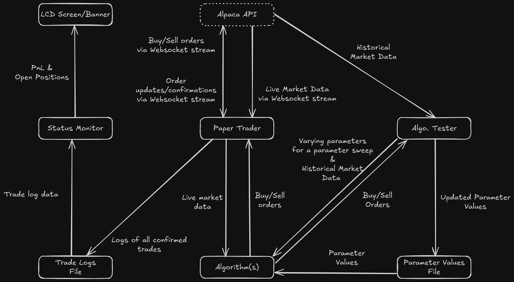

# PaperTrader
A program that paper trades (using fake money) stocks and ETFs (possibly stock options in the future!). The program executes buy/sell orders of stocks using the Alpaca Trading API based on pre-determined algorithms with variable parameters that are backtested. All confirmed trades are logged. A Status monitor reads the confirmed trade logs and creates Pnl & open positions information that get sent to a Raspberry Pi for displacy on an LCD.

## Architecture

Four separate parts that join together to embody this project.
- The actual trader that hooks up to the Alpaca websocket for market data via the API. Uses a predetermined algorithm to send buy/sell orders. Logs all trades.
  - Written in GO for concurrency and low-latency
- Algorithm developer/tester that collects historical data from the Alpaca API and backtests different algorithms as well as runs parameter sweeps.
  - Written in python for ease of iterability, readability, and data manipulation.
  - Possible future ML extensions 
- Status monitor that reads trade data/logs. Translates them into PnL and open positions and relays them to a Raspberyy Pi to display them on an LCD.
  - Written in Rust for hardware interaction.
- Algorithm(s) that take in market data and determine(s) buy/sell orders.
  - Read(s) in parameter values from a file that gets updates by the Algo. Tester
